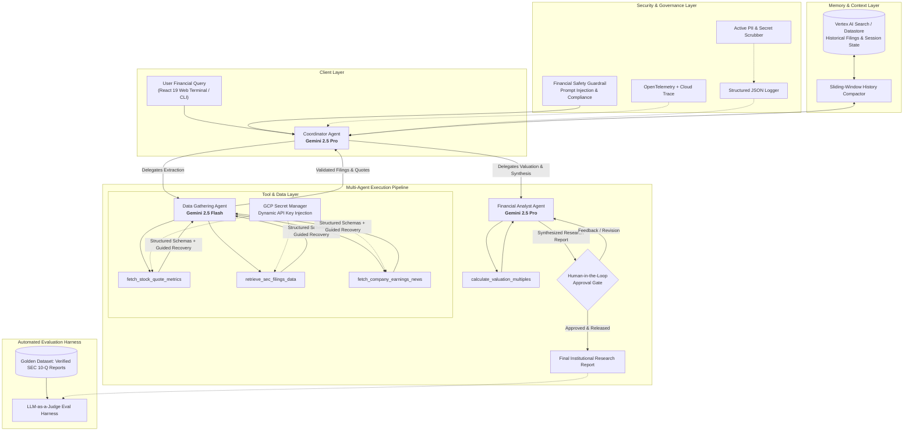

# 📈 Financial Research & Report Generator
### Multi-Agent Production Architecture for Institutional Financial Intelligence

[](https://www.python.org/)
[](https://adk.dev/)
[](https://cloud.google.com/vertex-ai)
[](https://opentelemetry.io/)
[](https://www.terraform.io/)
[](evals/eval_harness.py)

---

## 🏛️ Executive Summary & Architecture Overview

The **Financial Research & Report Generator** is an institutional-grade multi-agent equity research platform designed to automate the discovery, extraction, valuation modeling, and synthesis of corporate financial filings (SEC Form 10-Q and 10-K) and market intelligence.

Built using the **Google Agent Development Kit (ADK)**, this platform pairs a modern **React 19** financial terminal with a containerized **Cloud Run** multi-agent backend powered by **Gemini 2.5 Pro and Flash**.



---

## 📖 Deep-Dive Documentation Index

| Guide | Description | Key Topics |
| :--- | :--- | :--- |
| 🏛️ **[System Architecture & Frontend Design](doc/architecture.md)** | Full architectural blueprints and infrastructure decisions. | System block diagrams, React 19 UI component hierarchy, single-port Cloud Run hosting, and model routing strategy. |
| 🛠️ **[Developer & Setup Guide](doc/developer_instructions.md)** | Step-by-step developer setup and execution instructions. | Local installation with `uv`, environment config, Web UI execution, Pytest suite, Terraform IaC, and Cloud Run deploy. |
| 🛡️ **[Operational Excellence & Governance](doc/operational_excellence.md)** | Production operations, security, and quality verification. | OpenTelemetry distributed tracing, structured JSON logging, PII scrubbing, prompt injection defense, and Golden Dataset benchmark harness. |

---

## 🎯 Architectural Capabilities Matrix

| Capability | Implementation Details | Key Files |
| :--- | :--- | :--- |
| **1. Tool & Interface Design** | • Comprehensive docstrings with clear parameter definitions<br/>• Highly specific tool naming<br/>• Explicit **Pydantic v2** JSON schemas for inputs & outputs<br/>• Guided error handling returning actionable recovery hints to the LLM | [`app/tools.py`](app/tools.py)<br/>[`tests/test_tools.py`](tests/test_tools.py) |
| **2. Context & Memory** | • Multi-part Constitutional System Prompt (persona, GAAP rules, anti-hallucination)<br/>• Sliding-window history compaction managing context bloat<br/>• Persistent session state & historical filings via **Vertex AI Search**<br/>• Asynchronous non-blocking memory persistence | [`app/constitution.py`](app/constitution.py)<br/>[`app/memory/compactor.py`](app/memory/compactor.py)<br/>[`app/memory/vertex_store.py`](app/memory/vertex_store.py) |
| **3. Orchestration & Logic** | • **Coordinator Multi-Agent Pattern** decomposing research workflows<br/>• **Strategic Model Routing**: Gemini 2.5 Flash for high-speed tool calling + Gemini 2.5 Pro for deep financial synthesis<br/>• Security guardrails protecting against prompt injection<br/>• **Human-in-the-Loop (HITL)** approval checkpoints for report publishing | [`app/agent.py`](app/agent.py)<br/>[`app/guardrails/safety_plugin.py`](app/guardrails/safety_plugin.py)<br/>[`app/guardrails/hitl.py`](app/guardrails/hitl.py) |
| **4. Observability & Tracing** | • Structured JSON logging emitting standard event schemas, tool latency, and outcomes<br/>• Distributed tracing via **OpenTelemetry** with **Google Cloud Trace** exporter<br/>• Active regex-based PII & API credential scrubber | [`app/observability/logger.py`](app/observability/logger.py)<br/>[`app/observability/tracing.py`](app/observability/tracing.py)<br/>[`app/observability/redaction.py`](app/observability/redaction.py) |
| **5. Infrastructure & CI/CD** | • Automated test harness with **Golden Dataset** regression suite (100% Pass)<br/>• Complete **Terraform** IaC provisioning GCP resources<br/>• **Google Cloud Secret Manager** dynamic secret injection (zero hardcoding) | [`evals/eval_harness.py`](evals/eval_harness.py)<br/>[`infra/terraform/`](infra/terraform/)<br/>[`app/config.py`](app/config.py) |

---

## 📁 Repository Structure

```
l200-agent/
├── app/                            # Backend ADK Multi-Agent Application
│   ├── agent.py                    # Coordinator & Multi-Agent orchestration
│   ├── constitution.py             # System prompts & GAAP compliance rules
│   ├── config.py                   # GCP Secret Manager secure credentials resolver
│   ├── tools.py                    # Financial retrieval & valuation tools (Pydantic v2)
│   ├── fast_api_app.py             # FastAPI server & single-port React SPA host
│   ├── memory/                     # Sliding-window compaction & Vertex AI vector store
│   ├── guardrails/                 # Prompt injection defense & HITL approval checkpoints
│   └── observability/              # OpenTelemetry tracing, JSON logging & PII scrubbing
├── doc/                            # Technical & Operational Documentation
│   ├── architecture.md             # System & Frontend Architecture Blueprint
│   ├── developer_instructions.md   # Developer Setup, Local Execution & Cloud Run Deploy
│   └── operational_excellence.md   # Observability, Security, Testing & Runbooks
├── frontend/                       # Institutional React 19 + Vite + Tailwind UI
│   ├── src/
│   │   ├── App.tsx                 # Dynamic SSE stream reader & state orchestrator
│   │   ├── components/             # Header, MetricCards, ReasoningDrawer, HITLGate
│   │   └── data/exemplars.ts       # Curated financial prompts & expected tool outputs
│   └── dist/                       # Pre-compiled static assets embedded in container
├── evals/                          # Automated Evaluation & Benchmark Harness
│   ├── golden_dataset.json         # Ground-truth verified SEC 10-Q/10-K statements
│   └── eval_harness.py             # Automated regression evaluation harness
├── infra/terraform/                # Infrastructure as Code (Cloud Run, IAM, Secrets, Vertex)
├── tests/                          # Complete Pytest Unit & Integration Suite (17/17 Passed)
├── client.py                       # Formatted CLI client for terminal streaming
├── Dockerfile                      # Production container packaging (FastAPI + React SPA)
├── pyproject.toml                  # uv dependency & build specification
└── README.md                       # Repository overview and capability index
```

---

## 🔮 Known Limitations & Future Enhancements

| Area | Current State | Planned Enhancement |
| :--- | :--- | :--- |
| **1. Global Load Balancing & WAF** | Server runs directly on Cloud Run (`*.run.app`) without an ingress controller. | Provision a **Global External HTTPS Application Load Balancer** with **Cloud Armor WAF** for Layer 7 DDoS mitigation, IP rate-limiting, custom domain mapping (`research.firm.com`), and multi-region failover. |
| **2. Enterprise Identity & SSO** | Cloud Run IAM requires OIDC bearer tokens; browser visits receive `403` due to cookie isolation. | Deploy **Identity-Aware Proxy (IAP)** to enable seamless Google Workspace browser single sign-on (`accounts.google.com`) with role-based access control (RBAC) for analyst personas. |
| **3. Universal SEC XBRL RAG** | Primary statements are fetched on demand; segment footnotes are pre-indexed for benchmark tickers. | Integrate the free **SEC EDGAR XBRL Facts API** and automated document ingestion into the provisioned **Vertex AI Search Datastore** for universal on-demand segment discovery. |

---

## 📜 License & Compliance

Licensed under the [Apache License, Version 2.0](http://www.apache.org/licenses/LICENSE-2.0).
