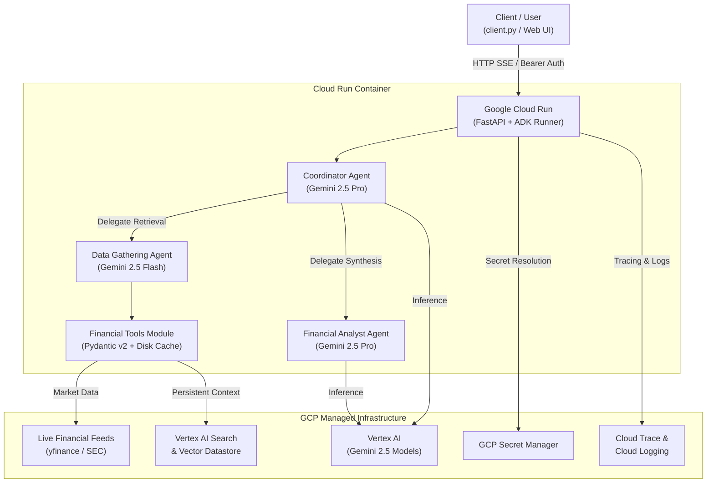

# 🏗️ Financial Research Agent - Architecture & Infrastructure Rationale

## 🎯 Goal
Provide an automated, institutional-grade equity research and financial report generation system. It orchestrates multi-agent workflows to fetch live SEC filings, calculate valuation multiples, and synthesize GAAP-compliant reports.

---

## 🧩 System Architecture

---

## ⚡ Infrastructure Decisions: What & Why

| Component | Choice | Purpose & Justification |
| :--- | :--- | :--- |
| **Compute** | **Google Cloud Run** | **Why serverless container?** Zero VM maintenance, sub-second auto-scaling (0-to-N), low cost, and native support for Server-Sent Events (SSE) token streaming. |
| **Model Routing** | **Gemini 2.5 Flash + Pro** | **Why dual models?** **Flash** provides ultra-low latency and low cost for fast tool selection; **Pro** provides deep financial reasoning and complex GAAP report drafting. |
| **Vector Store** | **Vertex AI Search** | **Why native GCP search?** Enterprise-grade persistent vector storage and RAG for company filings without self-hosting third-party vector databases. |
| **Secret Management**| **GCP Secret Manager** | **Why Secret Manager?** Dynamic runtime injection of financial API keys gated by IAM roles—eliminating hardcoded credentials. |
| **Observability** | **OpenTelemetry + Cloud Trace**| **Why OpenTelemetry?** Native distributed tracing across multi-agent turns, tool executions, and model calls with zero application code overhead. |
| **Infrastructure as Code** | **Terraform** | **Why Terraform?** Declarative, version-controlled provisioning of Cloud Run, IAM roles, Secret Manager, and Vertex AI resources. |
