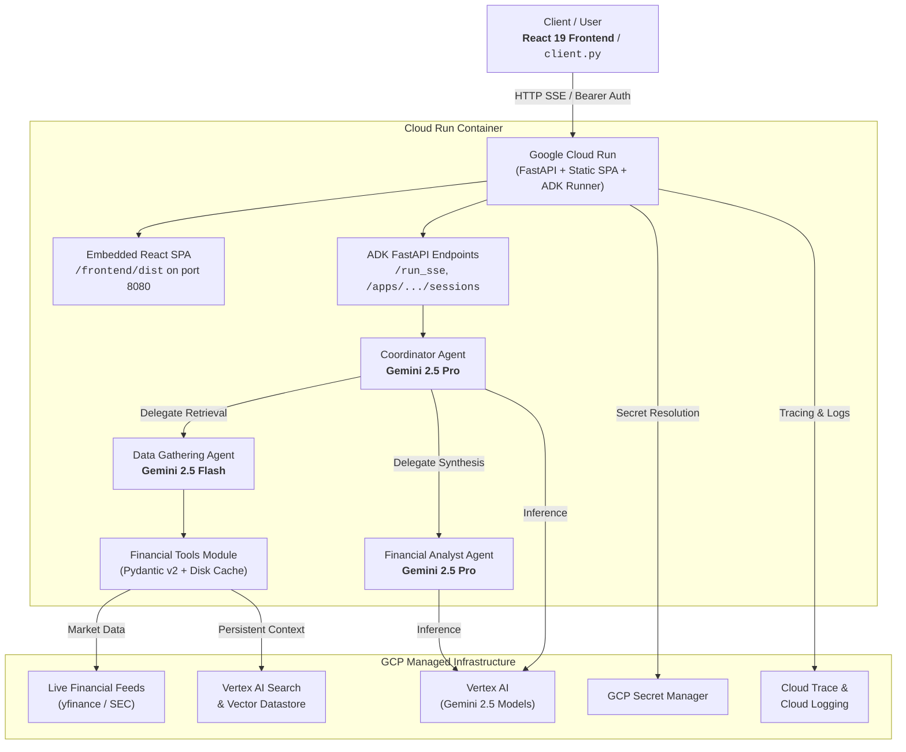
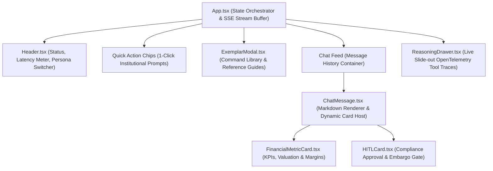

# 🏗️ Financial Research Agent - Architecture & Infrastructure Rationale

## 🎯 Goal
Provide an automated, institutional-grade equity research and financial report generation system. It orchestrates multi-agent workflows to fetch live SEC filings, calculate valuation multiples, and synthesize GAAP-compliant reports.

---

## 🧩 System Architecture

---

## 💻 Frontend Architecture & UI Component Hierarchy

The web interface is an institutional-grade, highly polished React application embedded directly into the production Cloud Run container, serving both the UI and backend agent APIs from a single port without cross-origin complexity.

### Tech Stack
- **Framework**: React 19 + TypeScript
- **Bundler & Tooling**: Vite 8 + Tailwind CSS
- **Markdown & Code Rendering**: `react-markdown` + GFM syntax highlighting
- **Iconography & Animations**: `lucide-react` + Tailwind CSS fluid keyframe transitions

### Key UI Capabilities & Components

| Component | File Path | Architectural Responsibility |
| :--- | :--- | :--- |
| **App Orchestrator** | [`frontend/src/App.tsx`](../frontend/src/App.tsx) | Session lifecycle initialization, persistent SSE stream buffer with TCP packet stitching, persona state management, and real-time financial metric parsing. |
| **Application Header** | [`frontend/src/components/Header.tsx`](../frontend/src/components/Header.tsx) | Live backend connectivity status, real-time token/network latency meter, and interactive signatory persona switcher (*Senior Analyst*, *VP Equity Research*, *Junior Associate*). |
| **Command Exemplar Library** | [`frontend/src/components/ExemplarModal.tsx`](../frontend/src/components/ExemplarModal.tsx) | Categorized exemplar prompt library across 4 domains (SEC Filings, Comparative Valuation, Live Market Quotes, Investment Theses) with expected tool outputs. |
| **Live Reasoning Drawer** | [`frontend/src/components/ReasoningDrawer.tsx`](../frontend/src/components/ReasoningDrawer.tsx) | Slide-out inspection drawer capturing live agent tool calls, execution duration (`ms`), input arguments, and raw JSON payloads. |
| **Financial Metric Card** | [`frontend/src/components/FinancialMetricCard.tsx`](../frontend/src/components/FinancialMetricCard.tsx) | Structured KPI grid displaying revenue, operating margins, P/E ratios, segment revenue breakdowns, and visual margin comparison bars. |
| **HITL Research Gate** | [`frontend/src/components/HITLCard.tsx`](../frontend/src/components/HITLCard.tsx) | 3-state compliance gate (*Pending Review*, *Approved & Released*, *Rejected*). Embargoes sensitive rating drafts with dynamic blur until signed by a supervisory analyst. |

### Single-Port Container Hosting
To maximize simplicity and eliminate CORS configuration errors in production:
1. `frontend/dist/` is compiled at build time.
2. [`app/fast_api_app.py`](../app/fast_api_app.py) mounts static assets at `/assets` and serves `index.html` at the root `/` route.
3. ADK Server-Sent Events (`/run_sse`) and session management endpoints (`/apps/app/...`) operate on the same origin and port (`8080`).

---

## ⚡ Infrastructure Decisions: What & Why

| Component | Choice | Purpose & Justification |
| :--- | :--- | :--- |
| **Compute** | **Google Cloud Run** | **Why serverless container?** Zero VM maintenance, sub-second auto-scaling (0-to-N), low cost, and native support for Server-Sent Events (SSE) token streaming. |
| **Single-Port UI & API** | **Embedded Static SPA** | **Why co-hosted frontend?** Eliminates separate Cloud Storage / CDN infrastructure, prevents CORS friction, and ensures atomic deployments between frontend and agent versions. |
| **Model Routing** | **Gemini 2.5 Flash + Pro** | **Why dual models?** **Flash** provides ultra-low latency and low cost for fast tool selection; **Pro** provides deep financial reasoning and complex GAAP report drafting. |
| **Vector Store** | **Vertex AI Search** | **Why native GCP search?** Enterprise-grade persistent vector storage and RAG for company filings without self-hosting third-party vector databases. |
| **Secret Management**| **GCP Secret Manager** | **Why Secret Manager?** Dynamic runtime injection of financial API keys gated by IAM roles—eliminating hardcoded credentials. |
| **Observability** | **OpenTelemetry + Cloud Trace**| **Why OpenTelemetry?** Native distributed tracing across multi-agent turns, tool executions, and model calls with zero application code overhead. |
| **Infrastructure as Code** | **Terraform** | **Why Terraform?** Declarative, version-controlled provisioning of Cloud Run, IAM roles, Secret Manager, and Vertex AI resources. |

---

## 📖 Related Documentation
- 🛡️ **Operational Excellence & Governance**: For details on distributed tracing, structured logging, PII scrubbing, security guardrails, test suites, and production runbooks, see [Operational Excellence Guide](operational_excellence.md).
